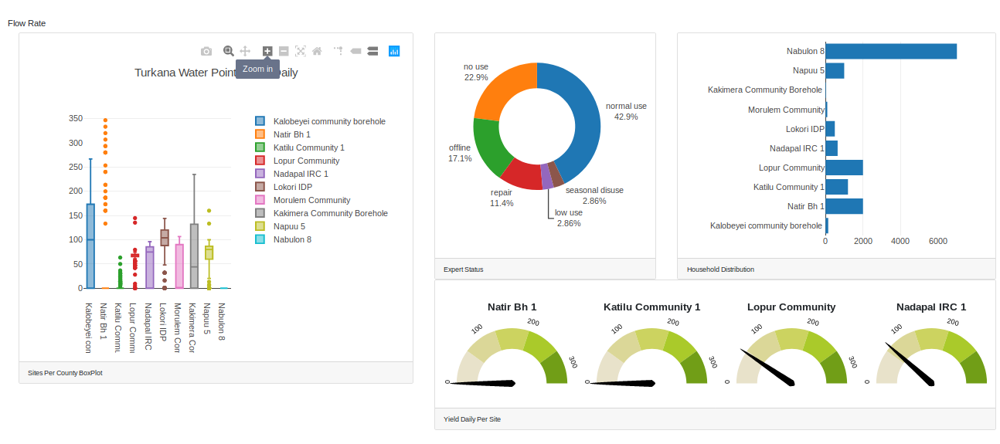

# water-engine-dashboard

## Kenyan Arid and Semi-Arid Waterpoint/Borehole Health and Performance.

Four visualization tools have been used to dynamically represent information per county on a rolling basis.
To represent the health of a waterpoint over its last 300 sensor logs a box plot is used to compare 10 sites maximum at a time. In the same order the respective site’s current flow rate reading is represented by a speedometer. Each speedometer is in the same order as the boxplot. The maximum value on the speedometer is the highest rate among the represented sites in the last 300 logs. On the same note, the load per site is represented by a bar graph that corresponds to the number of households. Overall, the percentage of pumps in a certain condition or state in the respective county is depicted on a doughnut chart.

This dashboard informs on the health and performance of the various sites collectively within the county as well as per site in Realtime.

The work product of this code i.e. the Dashboard can be seen in realtime [Here](https://waterengine.herokuapp.com/).
